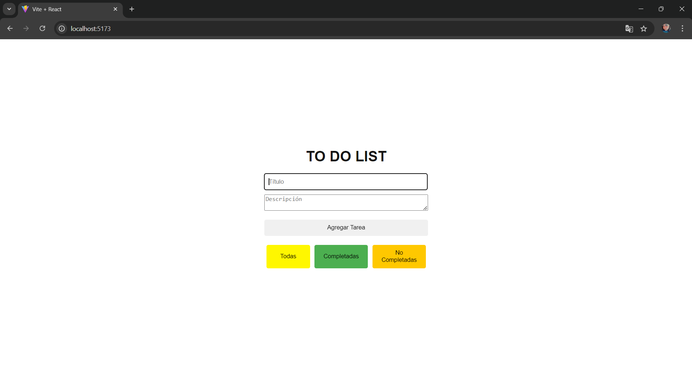
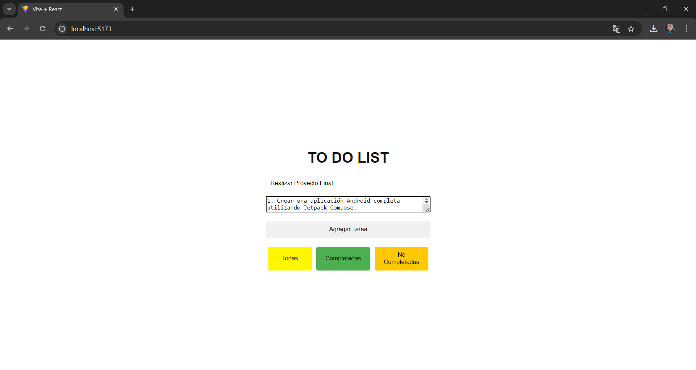
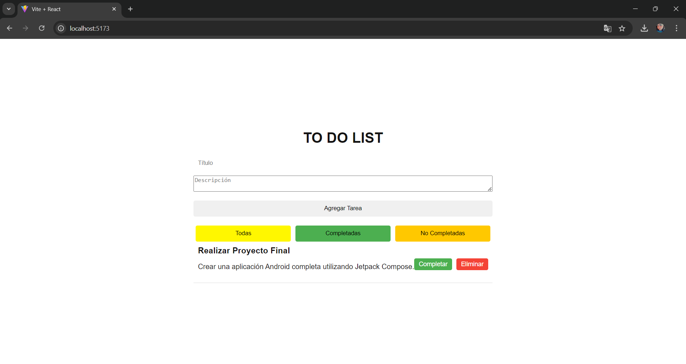
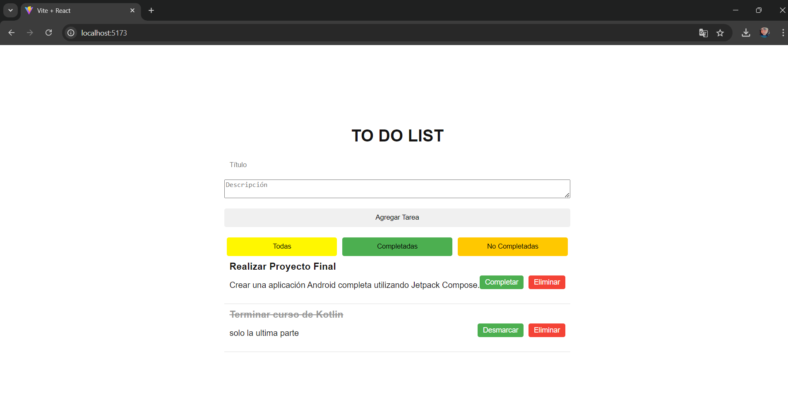

# GESTOR DE TAREAS
Estheixys Peña - 20220110

# Descripción del Proyecto

Este proyecto es una aplicación web para la gestión de tareas, construida con React. Permite a los usuarios crear, administrar y organizar sus tareas diarias. Los usuarios pueden añadir nuevas tareas con un título y una descripción, marcar tareas como completadas, eliminarlas y filtrar la vista para mostrar solo las tareas completadas, no completadas o todas las tareas.

# Objetivos del Proyecto

- Desarrollar una aplicación web completa con React.
- Aplicar conceptos de componentes, estado, props y eventos.
- Manejar estados complejos y renderizado condicional.
- Implementar una funcionalidad completa para la gestión de tareas.
- Practicar la depuración en aplicaciones React.

# Tecnologías
- React
- Vite para el entorno de desarrollo
- Herramientas de desarrollo de Google Chrome

# Funcionalidades
La aplicación debe permitir a los usuarios agregar, marcar como completadas, eliminar y filtrar tareas (completadas, no completadas o todas). Además, debe manejar un estado complejo para la lista de tareas y utilizar renderizado condicional para mostrar diferentes vistas según el estado. Se deben crear componentes reutilizables para la lista de tareas, los ítems de tarea y el formulario de nuevas tareas, utilizando props para la comunicación entre componentes. Finalmente, se debe incluir manejo de errores y usar herramientas de desarrollo para la depuración de la aplicación.

# Instalación y Uso
1. **Clonar el Repositorio:**
   
    **git clone https://github.com/EstheixysPHs/gestor-tarea.git**
   
 **Clona el repositorio de GitHub en tu máquina local. Esto descarga una copia del código fuente del proyecto en tu directorio actual.**
   
3. **Navegar al Directorio del Proyecto:**
   
   **cd Tarea**
   
 **Cambia el directorio actual al directorio del proyecto descargado. Esto es necesario para ejecutar los comandos de instalación y desarrollo dentro del contexto del proyecto.**
 
5. **Instalar Dependencias:**

 **npm install**
 
 **Instala todas las dependencias necesarias para el proyecto que están listadas en el archivo package.json. Esto incluye React, Vite y cualquier otra biblioteca o herramienta que el proyecto necesite para funcionar correctamente.**
 
4. **Iniciar el Servidor de Desarrollo:**
   
    **npm run dev**
   
**Inicia el servidor de desarrollo. Esto compila el proyecto y lo sirve en un entorno de desarrollo local, generalmente accesible en http://localhost:3000. El servidor también observa los cambios en el código fuente y actualiza la aplicación en el navegador en tiempo real.**

# Captura se interfaz del proyecto

# Video de la explicación
https://miucateciedu-my.sharepoint.com/:v:/g/personal/20220110_miucateci_edu_do/EZRiaDIbzHZArcm0U_DIoIMBBbCjEbD_SOcyVbvvMqCtIg?nav=eyJyZWZlcnJhbEluZm8iOnsicmVmZXJyYWxBcHAiOiJPbmVEcml2ZUZvckJ1c2luZXNzIiwicmVmZXJyYWxBcHBQbGF0Zm9ybSI6IldlYiIsInJlZmVycmFsTW9kZSI6InZpZXciLCJyZWZlcnJhbFZpZXciOiJNeUZpbGVzTGlua0NvcHkifX0&e=kfrUkY 
